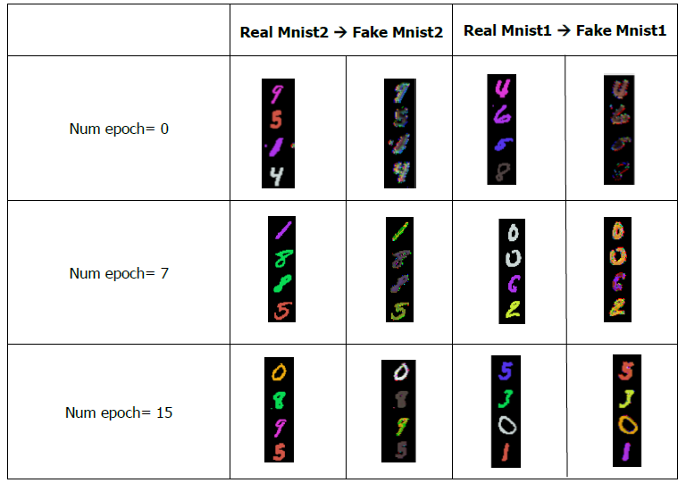

# CycleGAN_MNIST_Colorization

This project implements a CycleGAN using CNN for MNIST colorization. Transform grayscale digits to colored ones with latent space visualization.
## Implementation

### Background: 

#### GAN

GAN, or Generative Adversarial Network, is a deep learning framework comprising two neural networks, a generator, and a discriminator. They are trained simultaneously through adversarial training, where the generator creates realistic data, and the discriminator distinguishes between real and generated samples. This iterative process leads to the generator producing increasingly realistic outputs. 

### The model:

In this task, the goal was to create a CycleGAN. I designed Generators and Discriminators for each dataset using CNN , with a batch size of 100 and 15 epochs.

The training process consists of four stages. In the first stage, Discriminator1 is trained while Generator21 is "locked." In the second stage, Generator21 is trained while Discriminator1 is "locked". Stages 3 and 4 consider only Discriminator2 and Generator12. At each training stage for the Discriminator, the loss is the sum of the fake loss (from the Discriminator's evaluation on completely fake images) and the real loss (from images where "everything is correct"). This approach effectively trains the Discriminator to provide the desired results.

Two MNIST datasets were created, each colored differently for different digits:

MNIST1:

MNIST2:

## Results

The results are presented as follows: the right column represents the generated images, depicting digits colored to match the second dataset, while the left column represents the authentic color of each digit.

Observations:
- Epoch 0: The model hasn't learned sufficiently, and the obtained colors are unclear.
- Epoch 7: For mnist1, the model successfully transitions from grayscale to orange for digit 0. For mnist2, it seems the model hasn't yet managed to transition between colors.
- Epoch 15: For mnist1, the model successfully trained for all digits and presented colors. For mnist2 and digit 5, it appears the model still struggles to transition between red and blue. However, for digit 2, the model successfully trained to transition between turquoise and yellow.

It's interesting to note that the generator of model 1 succeeded in transitioning between colors (red to blue), while the generator of model 2 failed to perform the reverse step (blue to red). Overall, it seems that model 1 is better trained, producing outputs closer to the desired colors.
